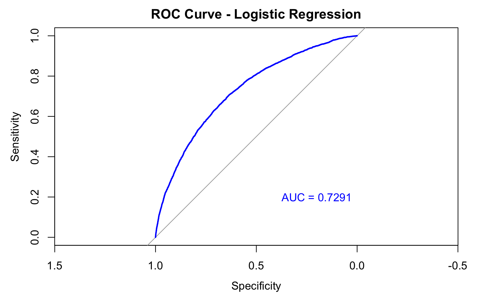
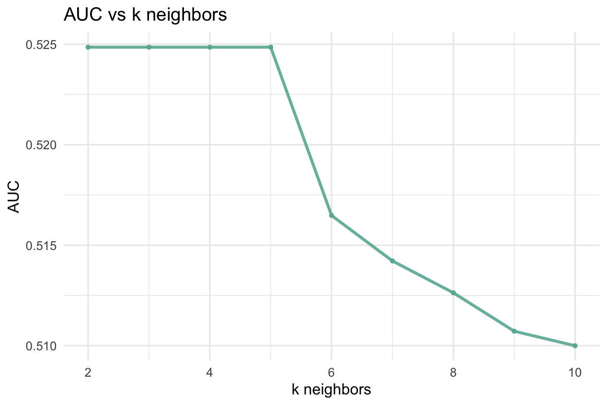
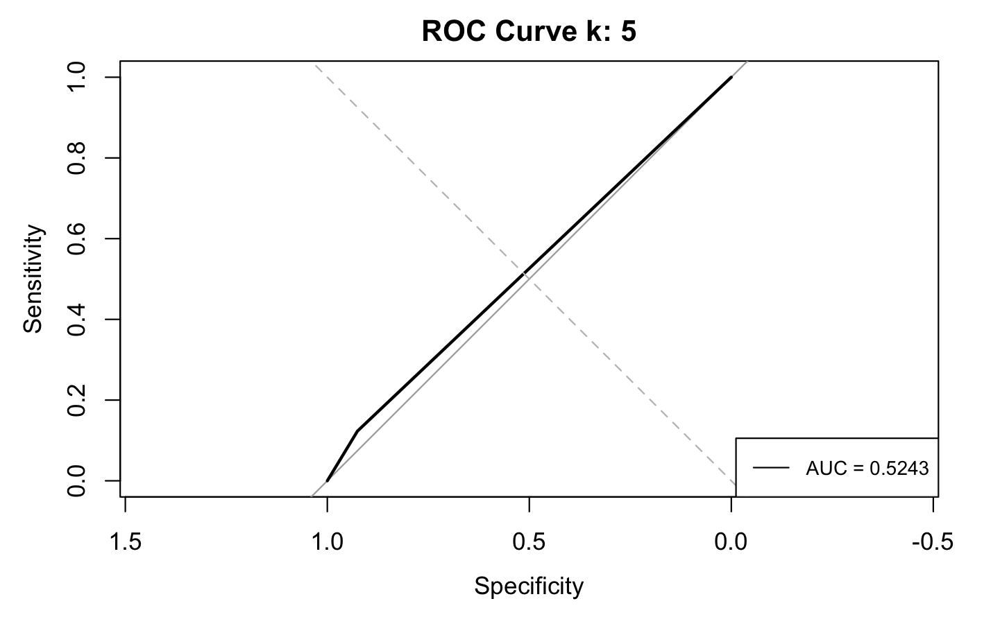

```{r setup, include=FALSE}
knitr::opts_chunk$set(echo = TRUE)
library(kernlab)
library(caret)
library(dplyr)
library(tidyverse)
library(kknn)
library(ggplot2)
library(GGally)
library(factoextra)
```

importing data and creating dummy variables for categorical values, done in scaleCont_dummy_vars.R

```{r importing data,results='hide',message=FALSE,cache=TRUE}
app_data <-read_csv(file = "/Users/kfung/Library/CloudStorage/Box-Box/MGT 6203/application_imputed_cleaner_v3.csv",
                    col_names = TRUE)

data <- subset(app_data,select=-c(`...1`,
                                  DAYS_BIRTH,DAYS_EMPLOYED,
                                  AGE_IN_YEARS_NUM,
                                  HAS_CHILDREN_NUM))

data$TARGET <- factor(data$TARGET, levels = c(0, 1))

#scale the continous data!!!!
# columns_to_scale <- c('CREDIT_TO_INCOME_RATIO', 'CREDIT_TO_ANNUITY_RATIO', 'CREDIT_TO_GOODS_PRICE_RATIO','AMT_INCOME_TOTAL' ,'AMT_CREDIT' ,'AMT_ANNUITY' ,'AMT_GOODS_PRICE' ,'EXT_SOURCE_1' ,'EXT_SOURCE_2' ,'OBS_30_CNT_SOCIAL_CIRCLE' ,'DEF_30_CNT_SOCIAL_CIRCLE' ,'OBS_60_CNT_SOCIAL_CIRCLE' ,'DEF_60_CNT_SOCIAL_CIRCLE' ,'DAYS_LAST_PHONE_CHANGE' ,'AMT_REQ_CREDIT_BUREAU_YEAR' ,'AGE_IN_YEARS' ,'EMPLOYED_IN_YEARS')
# scaled_numeric_data <- scale(data[, columns_to_scale])
# # Replace the scaled columns in the original data frame
# data[, columns_to_scale] <- scaled_numeric_data

#write.csv(data,file = "/Users/kfung/Library/CloudStorage/Box-Box/MGT 6203/application_imputed_dummy_vars_scaledContinuous.csv")
```

#### I'll be doing K-folds cross validation to find a good classifier for KNN model

1.  creating the training/validation and testing data sets and set the final_test_data aside to the test the model picked by LOOCV.

```{r,eval=FALSE}
#let's set a seed for reproducibility
set.seed(5678)
# possible future enhancement is to try oversampling
# first, separate dataset based on target = 0 and target = 1
data_0 <- data %>% 
  filter(TARGET == 0)
data_1 <- data %>%
  filter(TARGET == 1)
# separate the dataset into 80/20 (80% training and validation for cross validation and 20% for test)
n_0 <- sum(data$TARGET == 0)
n_1 <- sum(data$TARGET == 1)
split_value <- 0.80
#we are randomly shuffling the entire dataset and then splitting it up according the the split_value we set above.
training_valid_data_points_0 <- sample(x = 1:n_0, size = as.integer(split_value*n_0), replace = FALSE)
training_valid_data_points_1 <- sample(x = 1:n_1, size = as.integer(split_value*n_1), replace = FALSE)
# subsetting the data based on target = 0 and target = 1 to get the same distribution for the target variable in 
# the train/validation/test datasets
# train/validation dataset that will be used for k-fold cross-validation
train_valid_data_0 <- data_0[training_valid_data_points_0, ]
train_valid_data_1 <- data_1[training_valid_data_points_1, ]
# merging the separate train/validation datasets into one
train_valid_data <- bind_rows(train_valid_data_0, train_valid_data_1)

#subset for training and validating

# final dataset that will be used to analyze how well the best model (from k-fold cross-validation) performs
final_test_data_0 <- data_0[-training_valid_data_points_0, ]
final_test_data_1 <- data_1[-training_valid_data_points_1, ]
# merging the separate test datasets into one
final_test_data <- bind_rows(final_test_data_0, final_test_data_1)
#need to scale data (standardize and normalize)
# remove unneeded datasets to clear up memory space
rm(data_0)
rm(data_1)
rm(train_valid_data_0)
rm(train_valid_data_1)
rm(final_test_data_0)
rm(final_test_data_1)

# Perform oversampling using ROSE
# oversampled_train_valid_data <- ovun.sample(formula, data = train_valid_data, method = "both", 
#                                 N = nrow(train_valid_data))
# 
# oversampled_final_test_data<- ovun.sample(formula, data = final_test_data, method = "both", 
#                                 N = nrow(final_test_data))
# 
# train_valid_data <- oversampled_train_valid_data$data
# final_test_data <- oversampled_final_test_data$data
```

1.b. Before diving directly into KNN, I want to model this dataset with logistic regression just to get an idea.

```{r,eval=FALSE}
library(pROC)

#change 0's 1's to No's and Yes's
train_valid_data_logit <- train_valid_data %>%
  mutate(TARGET = fct_recode(TARGET, "No" = "0", "Yes" = "1"))

# creating binary variable for response / dependent variable
train_valid_data_logit <- train_valid_data_logit %>%
  mutate(TARGET_BINARY = if_else(TARGET == "No", 0, 1))

train_valid_data_logit <- train_valid_data_logit %>%
  mutate(TARGET_BINARY = if_else(TARGET == "No", 0, 1))

# define the function for running predictive models
model_type <- function(formula, method_input, metric_input) {
  # method_input = predictive model we would like to try out (ex: logistic regression, knn, gbm, svm, etc)
  # metric_input = what metric we want to use to evaluate the best fit model
  # Define your k-fold cross-validation control
  control <- trainControl(method = "cv", number = 5, classProbs = TRUE, summaryFunction = twoClassSummary, savePredictions = T)
  # model used on training data
  model <- train(formula, data = train_valid_data_logit, method = method_input, 
                  tuneLength = 5, preProcess = c("center", "scale"),  
                  trControl = control, metric = metric_input)
}

predictions <- function(model_name, model_number){
  predictions_df <- data.frame(
           obs = final_test_data$TARGET_BINARY, ## observed class labels
           predict(model_name, newdata = final_test_data, type = "prob"), ## predicted class probabilities
           pred = if_else(predict(model_name, newdata = final_test_data, type = "raw") == "No", 0, 1) ## predicted class labels
       ) 
  
  roc_curve <- roc(final_test_data$TARGET_BINARY, predictions_df[,3])
  cat("auc =",auc(roc_curve),"\n")
  #pdf(paste0("roc_curve_lr_", model_number, ".pdf"))
  roc_plot <- plot(roc_curve, main = "ROC Curve - Logistic Regression", col = "blue", lwd = 2)
  # Add AUC annotation
  text(0.2, 0.2, paste0("AUC = ", round(auc(roc_curve), 4)), col = "blue")
  #dev.off()
}

#Define training control
logit_model <- model_type((TARGET)~`AMT_INCOME_TOTAL`+`AMT_CREDIT`+`AMT_ANNUITY`+`AMT_GOODS_PRICE`+`EXT_SOURCE_1`+`EXT_SOURCE_2`+`OBS_30_CNT_SOCIAL_CIRCLE`+`DEF_30_CNT_SOCIAL_CIRCLE`+`OBS_60_CNT_SOCIAL_CIRCLE`+`DEF_60_CNT_SOCIAL_CIRCLE`+`DAYS_LAST_PHONE_CHANGE`+`AMT_REQ_CREDIT_BUREAU_YEAR`+`HAS_CHILDREN`+`AGE_IN_YEARS`+`EMPLOYED_IN_YEARS`+`CODE_GENDERF`+`NAME_CONTRACT_TYPERevolving_loans`+`FLAG_OWN_CARY`+`NAME_FAMILY_STATUSCivil_marriage`+`NAME_FAMILY_STATUSMarried`+`NAME_FAMILY_STATUSSeparated`+`NAME_FAMILY_STATUSSingle_not_married`+`NAME_FAMILY_STATUSWidow`+`OCCUPATION_TYPEAccountants`+`OCCUPATION_TYPECleaning_staff`+`OCCUPATION_TYPECooking_staff`+`OCCUPATION_TYPECore_staff`+`OCCUPATION_TYPEDrivers`+`OCCUPATION_TYPEHigh_skill_tech_staff`+`OCCUPATION_TYPEHR_staff`+`OCCUPATION_TYPEIT_staff`+`OCCUPATION_TYPELaborers`+`OCCUPATION_TYPELow_skill_Laborers`+`OCCUPATION_TYPEManagers`+`OCCUPATION_TYPEMedicine_staff`+`OCCUPATION_TYPEPrivate_service_staff`+`OCCUPATION_TYPERealty_agents`+`OCCUPATION_TYPESales_staff`+`OCCUPATION_TYPESecretaries`+`OCCUPATION_TYPESecurity_staff`+`OCCUPATION_TYPEWaiters_barmen_staff`+`EDUCATION_LEVELcollege_graduate`+`EDUCATION_LEVELhighschool_graduate`+`INCOME_BRACKET100k_150k`+`INCOME_BRACKET150k_200k`+`INCOME_BRACKET200k_250k`+`INCOME_BRACKET250k_300k`+`INCOME_BRACKET300k_UP`+`INCOME_BRACKET50k_100k` + `CREDIT_TO_INCOME_RATIO` + `CREDIT_TO_ANNUITY_RATIO` + `CREDIT_TO_GOODS_PRICE_RATIO`, 
                     data = train_valid_data_logit,
                     method_input = "glmnet",
                     metric_input = "ROC")

predictions(logit_model,1)
```



2.  In 6501, professor Sokol mentioned k=10 is a good value to use. It's not necessarily always the most optimal but smaller values of k (e.g \<5) can lead to higher variance in performance estimate because the evaluation is based on fewer data points which larger k's (\>10) can lead to higher bias in the estimate because each fold contains a smaller portion of the data.

run the LOOCV function on the training/validating data set (80% of whole dataset), and using k of 2-10, increment by 1 for knn model with the kernel 'optimal'.

```{r,eval=FALSE}
#create a df to store the results
results <- tibble()
#determine the loop for how many k_neighbors I want to try
k_neighbors <- seq(2, 10, by = 1)
#run the leave one out cross validation for the number of neighbors I used.
train_knn_fit <- train.kknn(TARGET~`AMT_CREDIT`+`AMT_ANNUITY`+`AMT_GOODS_PRICE`+`EXT_SOURCE_1`+`EXT_SOURCE_2`+`OBS_30_CNT_SOCIAL_CIRCLE`+`DEF_30_CNT_SOCIAL_CIRCLE`+`DAYS_LAST_PHONE_CHANGE`+`AMT_REQ_CREDIT_BUREAU_YEAR`+`HAS_CHILDREN`+`AGE_IN_YEARS`+`EMPLOYED_IN_YEARS`+`CODE_GENDERF`+`NAME_CONTRACT_TYPERevolving_loans`+`FLAG_OWN_CARY`+`NAME_FAMILY_STATUSCivil_marriage`+`NAME_FAMILY_STATUSMarried`+`NAME_FAMILY_STATUSSeparated`+`NAME_FAMILY_STATUSSingle_not_married`+`NAME_FAMILY_STATUSWidow`+`OCCUPATION_TYPEAccountants`+`OCCUPATION_TYPECleaning_staff`+`OCCUPATION_TYPECooking_staff`+`OCCUPATION_TYPECore_staff`+`OCCUPATION_TYPEDrivers`+`OCCUPATION_TYPEHigh_skill_tech_staff`+`OCCUPATION_TYPEHR_staff`+`OCCUPATION_TYPEIT_staff`+`OCCUPATION_TYPELaborers`+`OCCUPATION_TYPELow_skill_Laborers`+`OCCUPATION_TYPEManagers`+`OCCUPATION_TYPEMedicine_staff`+`OCCUPATION_TYPEPrivate_service_staff`+`OCCUPATION_TYPERealty_agents`+`OCCUPATION_TYPESales_staff`+`OCCUPATION_TYPESecretaries`+`OCCUPATION_TYPESecurity_staff`+`OCCUPATION_TYPEWaiters_barmen_staff`+`EDUCATION_LEVELcollege_graduate`+`EDUCATION_LEVELhighschool_graduate` + `CREDIT_TO_INCOME_RATIO` + `CREDIT_TO_ANNUITY_RATIO` + `CREDIT_TO_GOODS_PRICE_RATIO`
                              ,data = train_valid_data,
                              ks = k_neighbors,
                              distance = 1,
                              kernel = "optimal",
                              scale = TRUE)
  #saveRDS(train_knn_fit,file = "train_knn_fit_k_2_10.rds")
  #train_knn_fit <- readRDS(file="train_knn_fit_k_4_8.rds")


for(k in k_neighbors){
    #getting the fitted value
    fitted_value <-as.numeric(as.character(train_knn_fit$fitted.values[[k-1]]))
    #getting ROC and AUC
    # Calculate the ROC curve
    roc_obj <- roc(train_valid_data$TARGET, fitted_value)
    
    # Calculate the AUC
    auc_val <- auc(roc_obj)
    print(paste("cur k: ", k))
    cat("auc_value:", auc_val)
    # Plot ROC Curve
    plot(roc_obj, main = paste("ROC Curve","k:",k))
    abline(a = 0, b = 1, lty = 2, col = "gray")
    legend("bottomright", 
           legend = paste("AUC =", round(auc_val, 4)),
           col = "black", lty = 1, cex = 0.8)

    #confusionMat
    # #testing_data$TARGET <- factor(testing_data$TARGET, levels = levels(fitted_value))
    cm <- confusionMatrix(as.factor(fitted_value),as.factor(train_valid_data$TARGET))
    print(cm)
  #run the knn function and get the accuracy value for the above sets
  # knn_res <- knn_AUC(training_data,testing_data,
  #                             k = kn,kernel = "optimal")
  #staging the results to add to final df
  result_temp <- data.frame(k_neighbor=k, 
                           AUC=auc_val)
  print(paste("res: ", result_temp))
  #add results to final df
  results <- rbind(results,result_temp)
  
  return (results)
}
  
#write.csv(results,file = "../Visualizations/train_knn_k2_10_AUC.csv")
```

| k_neighbor | AUC        |
|------------|------------|
| 2          | 0.52485349 |
| 3          | 0.52485349 |
| 4          | 0.52485349 |
| 5          | 0.52485349 |
| 6          | 0.51647879 |
| 7          | 0.5142171  |
| 8          | 0.51263344 |
| 9          | 0.510721   |
| 10         | 0.50999624 |


```{r, fig.height=4,fig.width=6,eval=FALSE}
#take the average of all 10 evaluations per k neighbor value and sort by highest mean accuracy
results <- results %>%
  arrange(desc(AUC))

#save these values for testing below.
best_k_neighbor <- result$k_neighbor[1]
best_AUC <- result$AUC[1]

#plot the results
ggplot(results, aes(x=k_neighbor, y=AUC)) +
  geom_line( color="#69b3a2", size=1, alpha=0.9, linetype=1) +
  geom_point(color="#69b3a2",size=1) +
  ggtitle("AUC vs k neighbors") + theme_minimal() +
  labs(
    x = "k neighbors",
    y = "AUC"
  ) +
  theme(
    axis.title.x = element_text(color = "black"),
    axis.title.y = element_text(color = "black")
  )
```



So according to the results table, we can see that the k values for kknn that performed the best via LOOCV was k=5 with an AUC of 0.5248535. We will pick this model. Moving on to the final portion of the cross validation phase, evaluating this model on the testing data we portioned out at the beginning.


First, I define the function for running knn and obtaining the AUC

```{r, knn,message=FALSE,eval=FALSE}
# define the function for running KNN and returning the accuracy value
knn_AUC <- function(training_data, testing_data, k, kernel){
    formula <- TARGET~`AMT_CREDIT`+`AMT_ANNUITY`+`AMT_GOODS_PRICE`+`EXT_SOURCE_1`+`EXT_SOURCE_2`+`OBS_30_CNT_SOCIAL_CIRCLE`+`DEF_30_CNT_SOCIAL_CIRCLE`+`DAYS_LAST_PHONE_CHANGE`+`AMT_REQ_CREDIT_BUREAU_YEAR`+`HAS_CHILDREN`+`AGE_IN_YEARS`+`EMPLOYED_IN_YEARS`+`CODE_GENDERF`+`NAME_CONTRACT_TYPERevolving_loans`+`FLAG_OWN_CARY`+`NAME_FAMILY_STATUSCivil_marriage`+`NAME_FAMILY_STATUSMarried`+`NAME_FAMILY_STATUSSeparated`+`NAME_FAMILY_STATUSSingle_not_married`+`NAME_FAMILY_STATUSWidow`+`OCCUPATION_TYPEAccountants`+`OCCUPATION_TYPECleaning_staff`+`OCCUPATION_TYPECooking_staff`+`OCCUPATION_TYPECore_staff`+`OCCUPATION_TYPEDrivers`+`OCCUPATION_TYPEHigh_skill_tech_staff`+`OCCUPATION_TYPEHR_staff`+`OCCUPATION_TYPEIT_staff`+`OCCUPATION_TYPELaborers`+`OCCUPATION_TYPELow_skill_Laborers`+`OCCUPATION_TYPEManagers`+`OCCUPATION_TYPEMedicine_staff`+`OCCUPATION_TYPEPrivate_service_staff`+`OCCUPATION_TYPERealty_agents`+`OCCUPATION_TYPESales_staff`+`OCCUPATION_TYPESecretaries`+`OCCUPATION_TYPESecurity_staff`+`OCCUPATION_TYPEWaiters_barmen_staff`+`EDUCATION_LEVELcollege_graduate`+`EDUCATION_LEVELhighschool_graduate` + `CREDIT_TO_INCOME_RATIO` + `CREDIT_TO_ANNUITY_RATIO` + `CREDIT_TO_GOODS_PRICE_RATIO`
    print(paste("cur k: ", k))
    #running the model/prediction using the predefined inputs
    kknn_model <- kknn(formula = formula, training_data, testing_data, k = k, kernel = kernel,scale = TRUE)
    
    #kknn_model <- kknn(formula = formula, train_valid_data, final_test_data, k = k, kernel = "optimal",scale = TRUE)
    #getting the fitted value
    fitted_value <-as.numeric(as.character(kknn_model$fitted.values))
    #getting ROC and AUC
    # Calculate the ROC curve
    roc_obj <- roc(final_test_data$TARGET, fitted_value)
    
    # Calculate the AUC
    auc_val <- auc(roc_obj)
    print(paste("cur k: ", k))
    cat("auc_value:", auc_val, "\n")
    # Plot ROC Curve
    plot(roc_obj, main = paste("ROC Curve","k:",k))
    abline(a = 0, b = 1, lty = 2, col = "gray")
    legend("bottomright", legend = paste("AUC =", round(auc_val, 4)), col = "black", lty = 1, cex = 0.8)

    #confusionMat
    # #testing_data$TARGET <- factor(testing_data$TARGET, levels = levels(fitted_value))
    cm <- confusionMatrix(as.factor(fitted_value),as.factor(final_test_data$TARGET))
    print(cm)
    # cm_accuracy <- cm$overall["Accuracy"]
    # print(paste("Accuracy:", cm_accuracy))
    return(auc_val)
}
```

3.  Train chosen model on all of train_valid_data and evaluate on test_data. Then report the AUC as it is performance on test_data.

```{r,eval=FALSE}
cv_test_AUC <- knn_AUC(training_data = train_valid_data,
                                 testing_data = final_test_data,
                                 k = best_k_neighbor,
                                 kernel = "optimal")
```




## closing thoughts

As we can see, knn's AUC is very lackluster compared to logistic regression. It was also much more computationally inefficient compared to logistic regression as it had a quadratic run time in comparisons.