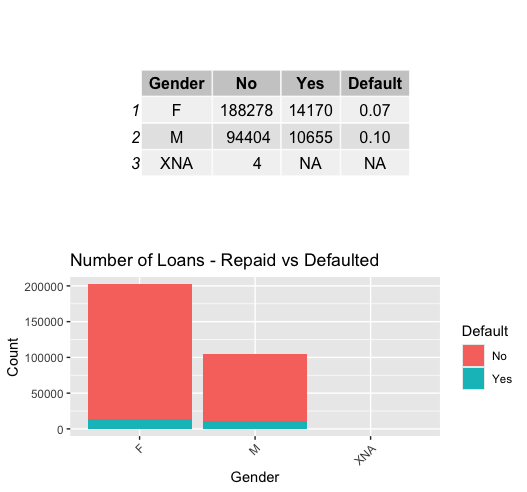
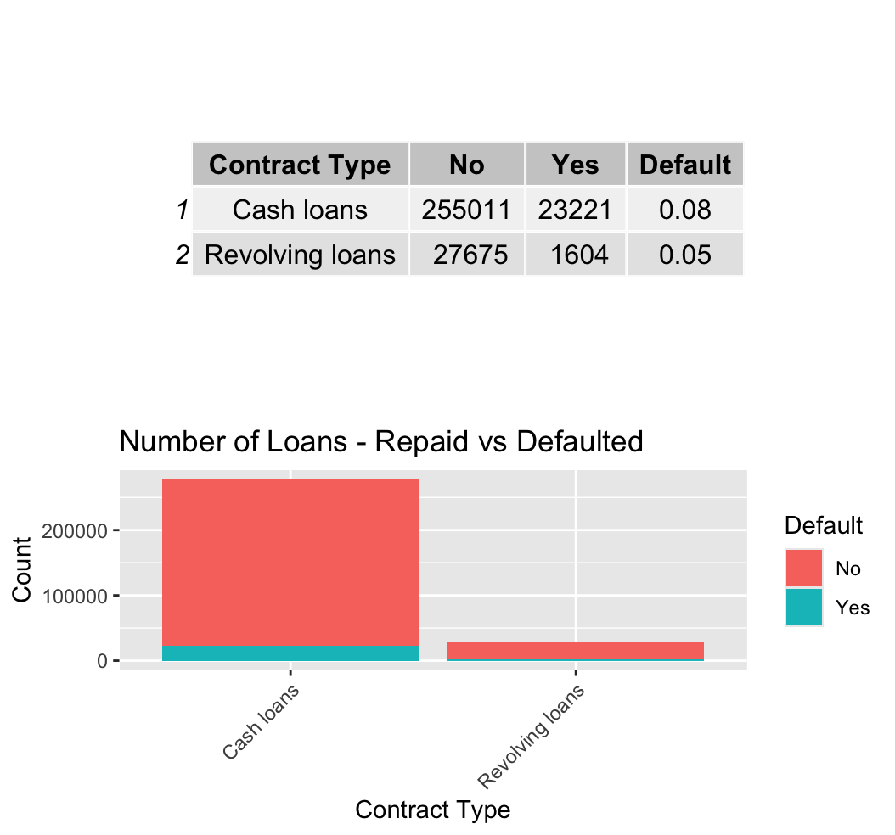
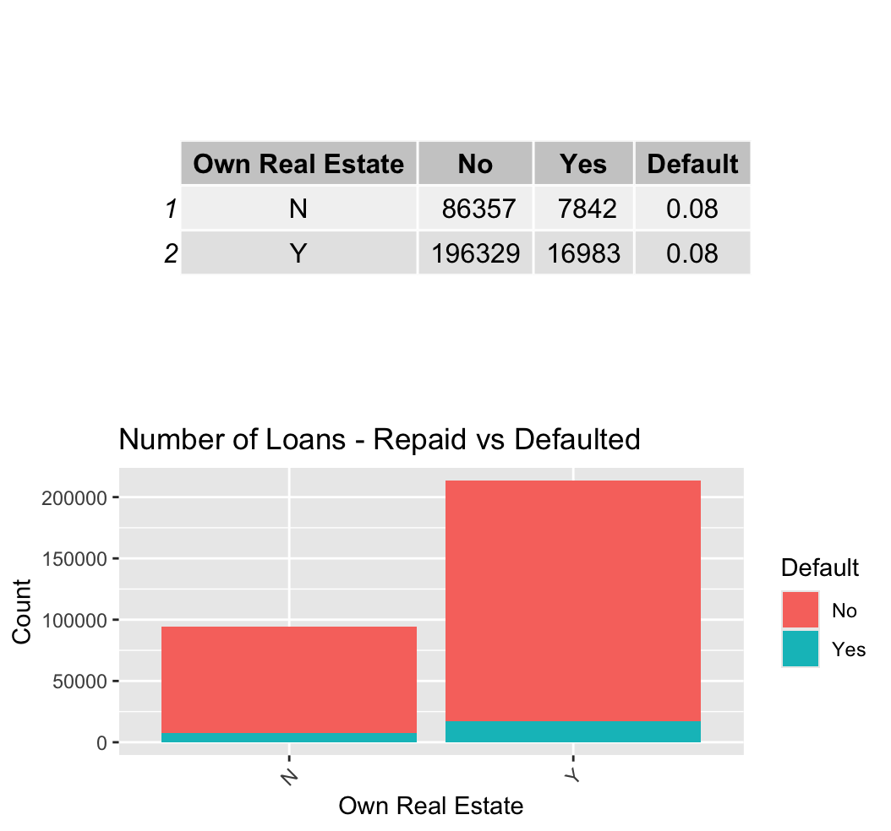
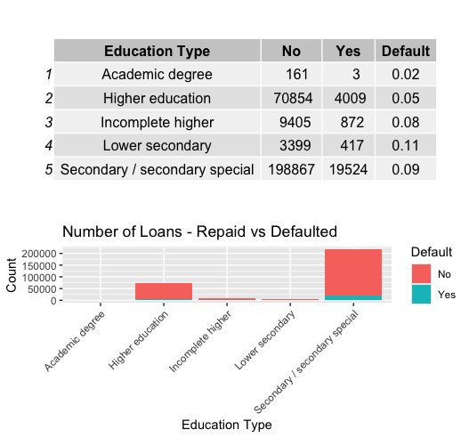
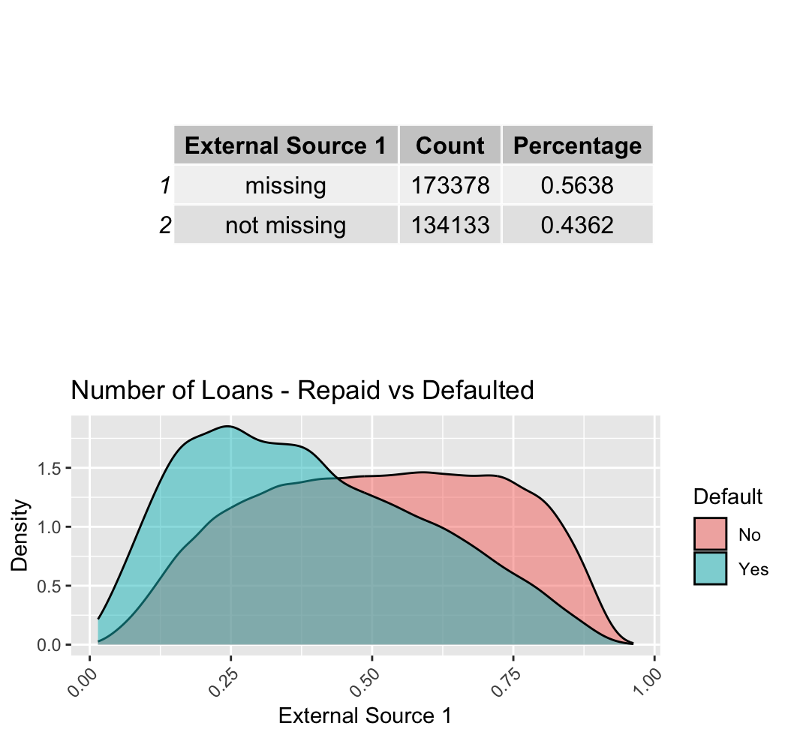
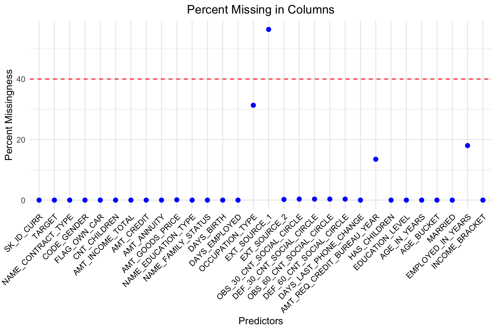
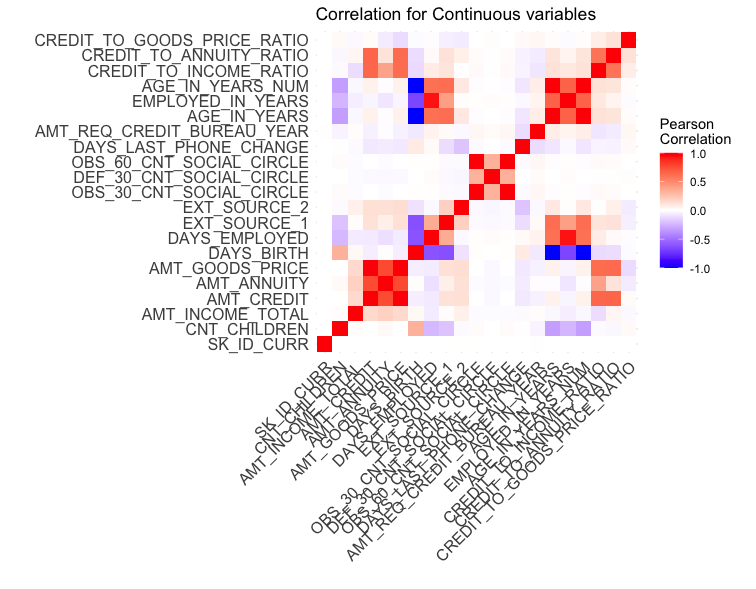

# Predicting Loan Default for Home Credit Applicants

## Overview

In this project, we aim to analyze the Probability of Loan Default for Home Credit applicants. Our objective is to accurately predict the likelihood of an applicant defaulting on a loan without utilizing the most conventional predictor, the credit score. We hypothesize that demographic variables along with loan amount and yearly income will play significant roles in predicting default behavior. The predictive model of choice for this analysis is regularized logistic regression.

## Data

Home Credit has generously provided seven datasets containing application data from both current and previous loans. These datasets encompass information on clients' loan applications at Home Credit and other financial institutions. A significant challenge encountered was merging these datasets into a cohesive unit. Due to complexities arising from one-to-many relationships within the datasets, we opted to utilize the main dataset, which comprises 124 predictor variables.

## Exploratory Data Analysis

### Univariate Analysis

We initiated our analysis by conducting a univariate examination of categorical variables to gain insights into loan default behavior. The following variables were explored: gender, loan type, own real estate flag, and education level.

#### Gender

- Females tend to acquire nearly double the number of loans compared to males.
- Default rates are lower among female applicants.

#### Loan Type

- Majority of loans are cash loans.
- Revolving loans, such as credit cards, are less prevalent among Home Credit's clientele, possibly due to insufficient credit history.

#### Own Real Estate Flag

- Approximately two-thirds of clients own real estate.
- Surprisingly, no significant difference in default rates is observed between clients who own real estate and those who do not.

#### Education Level

- Higher education levels correlate with lower default rates.
- Education level emerges as a crucial predictor of loan default probability.

### Continuous Variables Analysis

We analyzed the probability density functions of continuous variables from external sources 1 and 2. Despite limited context, these normalized scores exhibit distinct distributions between default and non-default classes.

- External source 1 shows a notable difference between default and non-default classes, suggesting high predictive potential despite missing data.

### Additional Insights

- Anomalies in the "number of days employed" variable were discovered, indicating data inconsistencies.
- Analysis of occupation type reveals distinct default patterns, with "white-collar" occupations exhibiting lower default rates compared to "blue-collar" occupations.
- Income binning highlights nuanced default trends, with higher income brackets demonstrating lower default rates.

# Data Preprocessing

## Handling Missing Values

A significant portion of our dataset contained missing values, leading us to employ various strategies for managing them.

### Removal of Variables with High Missingness

We decided to remove variables with over 40% missingness as salvaging these would be challenging even with imputation.

### Treatment of "FLAG_" Variables

We examined a series of variables starting with "FLAG_", which provided generic information about whether a client provided email/documents. Tetrachoric correlation analysis revealed no meaningful relationship with our response variable, leading to the removal of these flags (Juras, 2006, p. 1).

### Manual Appraisal and Imputation

Remaining variables were manually appraised using the documentation file of column attributes. Variables deemed not particularly useful, such as those containing information about the number of elevators in a building, were omitted.

## Imputation

Given the benefit of deducing imputed values from observations with similar characteristics, hot-deck imputation was a natural choice. Key demographic variables (age/income/gender/married/education/parental status) were selected as donor variables. However, four observations with missing gender values were omitted due to the inability to reasonably impute them. The "mice" package successfully imputed the rest of our variables, except for occupation type, a categorical variable.

## Feature Engineering

In order to analyze the interaction between several continuous numeric variables relating directly to the amount of credit offered to an applicant, we utilized feature engineering. Three variables were constructed: CREDIT_TO_INCOME_RATIO, CREDIT_TO_ANNUITY_RATIO, and CREDIT_TO_GOODS_PRICE_RATIO, quantifying the relationships between credit amount and applicant income, loan annuity, and goods price, respectively.

## Data Transformation

Certain variables required conversion into more intuitive categories for predictive modeling and interpretation purposes. For instance, days since birth were converted into standard age in years, days employed into years employed, and the number of children into a binary "HAS_CHILDREN" flag. Additionally, education attainment categories were simplified into three easy-to-interpret categories: incomplete high school education, complete high school education, and complete college education. Family statuses were initially collapsed into a binary "MARRIED" flag but were eventually removed in favor of the original categories due to differences in loan repayment distributions across various family statuses.

## Variable Correlations

A critical aspect of our analysis involved examining the correlations between various variables to understand their impact on the probability of loan default.

### Categorical To Categorical

We utilized Cramér’s V statistic to measure the association between categorical variables. For example, we found a strong correlation between gender and occupation type (Cramer’s V = 0.405), suggesting occupation-related credit risk might not be gender-neutral.

### Continuous To Continuous

A heatmap revealed high correlations between certain continuous variables, such as AMT_GOODS_PRICE and AMT_CREDIT, indicating that as credit amounts increase, so does the value of the goods for which the credit is taken.

### Categorical To Continuous

We conducted ANOVA tests to explore how continuous variables vary across different categories. One interesting finding was the lack of significant variation in credit amounts based on the presence of children (p-value = 0.87108), contrary to expectations.

# Modeling Methodology

## Methodology

We employed several predictive modeling techniques to solve the binary classification problem of determining whether a loan applicant is likely to default. The models evaluated included regularized logistic regression, random forest, K-nearest neighbors (KNN), gradient boosting machines (GBM), probit regression, and support vector machines (SVM).

## Model Evaluation

To measure model performance, we used the Area under the Receiver Operating Characteristic Curve (AUROC) metric due to the class imbalance in the response variable. Models were evaluated on a test dataset, with AUROC serving as the primary performance metric.

# Results

Based on the test AUROC metric, we selected the regularized logistic regression model as the predictive model for Home Credit. Although the GBM model returned the highest test AUROC, logistic regression was chosen for its interpretability, regulatory compliance, and stakeholder acceptance.

# Conclusion

Our analysis provided valuable insights into the factors influencing credit payment difficulties for Home Credit applicants. By implementing the regularized logistic regression model, Home Credit can effectively assess the probability of loan default and mitigate financial losses. Future endeavors may focus on further improving model accuracy through techniques such as occupation status imputation and exploration of additional datasets.

# Citations: (APA 6th Edition)

Blagus, R., Lusa, L. Joint use of over- and under-sampling techniques and cross-validation for the development and assessment of prediction models. BMC Bioinformatics 16, 363 (2015). [DOI](https://doi.org/10.1186/s12859-015-0784-9)

Jeni, L. A., Cohn, J. F., & De La Torre, F. (2013). Facing imbalanced data--recommendations for the use of performance metrics. IEEE: 245-251. [PDF](https://laszlojeni.com/pub/articles/Jeni13ACII.pdf)

Juras, J. i Pasarić, Z. (2006). Application of tetrachoric and polychoric correlation coefficients to forecast verification. Geofizika, 23 (1), 59-82. [Link](https://hrcak.srce.hr/4211)

Myers, T. A. (2011). Goodbye, Listwise Deletion: Presenting Hot Deck Imputation as an Easy and Effective Tool for Handling Missing Data. Communication Methods and Measures, 5(4), 297-310. [DOI](https://doi.org/10.1080/19312458.2011.624490)
